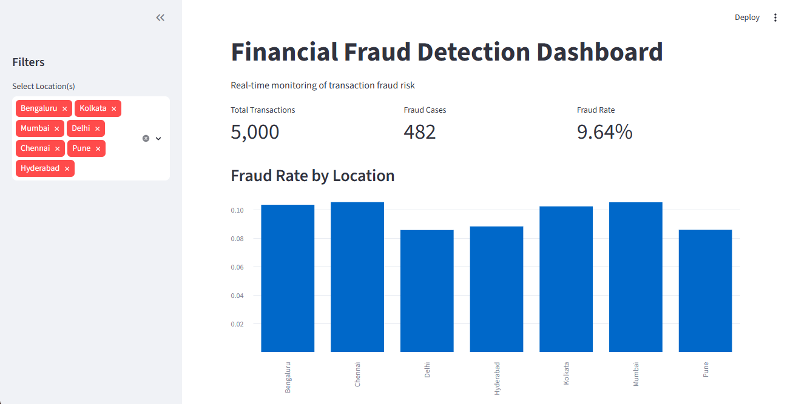
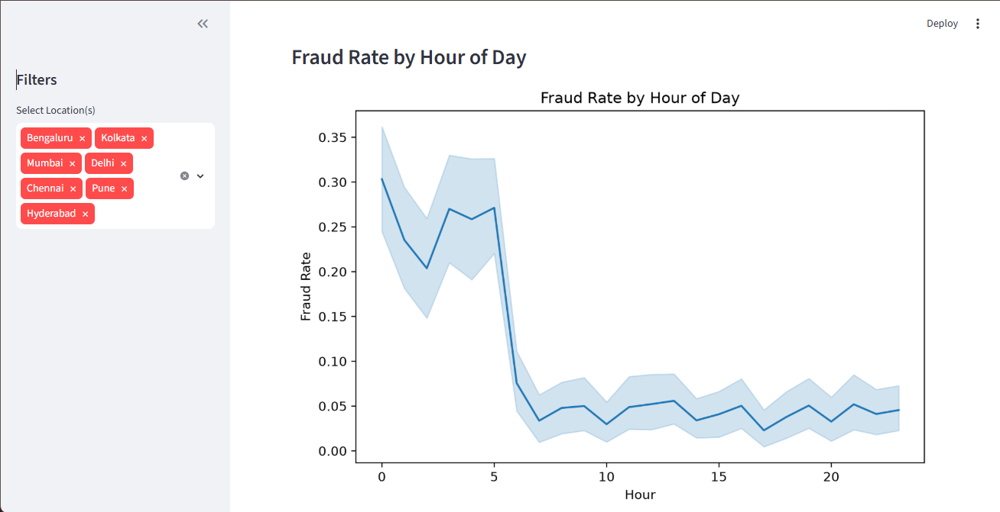

# 💳 Financial Fraud Detection System

An end-to-end fraud detection project that combines exploratory data analysis, multiple machine learning models, a SQLite-backed ETL pipeline, a simulated real-time transaction stream with automated alerting, and a live Streamlit monitoring dashboard.

---

## 📌 Overview

This project analyzes 5,000 financial transactions to understand fraud behavior, builds and compares three classification models, and wraps the best-performing model in a lightweight real-time monitoring system — from raw CSV data all the way to a live, interactive dashboard.

**Fraud rate in the dataset:** 9.64% (482 fraudulent transactions out of 5,000)

---

## 🏗️ System Architecture

```
Raw CSV
   │
   ▼
SQLite Database (ETL)
   │
   ▼
Feature Engineering
   │
   ▼
Model Training  ──►  Logistic Regression / Random Forest / Isolation Forest
   │
   ▼
Best Model Saved (pickle)
   │
   ▼
Simulated Real-Time Stream ──► Alert System (logged)
   │
   ▼
Streamlit Live Dashboard
```

---

## 🔍 Key Findings (EDA)

| Feature | Fraud Rate Impact |
|---|---|
| Suspicious Keyword present | 47.3% vs 7.6% (~6x higher) |
| International transaction | 37% vs 7% (~5x higher) |
| Night hours (12 AM–5 AM) | 20–38% vs 5–8% (daytime) |
| Location, merchant category, day of week | Weak impact |
| Transaction amount, account age, device type | Negligible impact |

These same three signals — **suspicious keyword, international status, and night-time transactions** — were independently confirmed as the strongest predictors when the trained model's feature coefficients were examined, validating the EDA findings statistically.

---

## 🤖 Model Comparison

| Model | Type | Precision (Fraud) | Recall (Fraud) | ROC-AUC |
|---|---|---|---|---|
| **Logistic Regression** ✅ | Supervised | 27% | **100%** | 0.885 |
| Random Forest | Supervised | 34% | 32% | 0.884 |
| Isolation Forest | Unsupervised | 36% | 36% | — |

**Logistic Regression** was selected as the final model — in fraud detection, missing a real fraud case (a false negative) is typically far more costly than a false alarm, and this model caught **100% of fraud cases** on the test set while remaining fully interpretable.

---

## ⚙️ Tech Stack

- **Language:** Python
- **Data Analysis:** pandas, numpy
- **Visualization:** matplotlib, seaborn
- **Machine Learning:** scikit-learn (Logistic Regression, Random Forest, Isolation Forest)
- **Database:** SQLite
- **Dashboard:** Streamlit
- **Model Persistence:** pickle

---

## 📁 Project Structure

```
financial_fraud_analysis/
│
├── data/
│   ├── credit_card_fraud_dataset.csv
│   ├── financial_fraud_detection_dataset.csv   ← primary dataset used
│   ├── Fraud Detection.csv
│   └── synthetic_fraud_dataset1.csv
│
├── database/
│   └── fraud_detection.db
│
├── models/
│   ├── feature_columns.pkl
│   └── logistic_regression_model.pkl
│
├── notebooks/
│   └── fraud_analysis.ipynb
│
├── outputs/
│   ├── dashboard_1.png
│   ├── dashboard_2.png
│   └── fraud_alerts.log
│
├── scripts/
│   ├── dashboard.py
│   └── stream_simulator.py
│
├── .gitignore
├── financial_fraud_detection_report.pdf
├── README.md
└── requirements.txt
```

> **Note:** The `data/` folder contains a few additional fraud datasets that were evaluated during planning. `financial_fraud_detection_dataset.csv` is the one actually used throughout this project (EDA, feature engineering, and modeling).

---

## 🚀 How to Run

### 1. Clone the repository
```bash
git clone https://github.com/hraiyani-data/financial-fraud-detection.git
cd financial-fraud-detection
```

### 2. Install dependencies
```bash
pip install -r requirements.txt
```

### 3. Explore the analysis
Open `notebooks/fraud_analysis.ipynb` in Jupyter or VS Code and run the cells to reproduce the full EDA, feature engineering, model training, and evaluation.

### 4. Run the real-time stream simulator
```bash
python scripts/stream_simulator.py
```
Simulates transactions arriving one at a time and triggers fraud alerts in real time, logged to `outputs/fraud_alerts.log`.

### 5. Launch the live dashboard
```bash
python -m streamlit run scripts/dashboard.py
```
Opens an interactive dashboard at `http://localhost:8501` showing live fraud metrics, charts, and recent alerts.

---

## 📊 Dashboard Preview




---

## 📈 Precision-Recall Trade-off

The default classification threshold (0.5) maximizes recall (100%) at the cost of precision (27%). Raising the threshold toward 0.75–0.9 improves precision at the expense of recall — giving flexibility to tune the system based on whether minimizing missed fraud or minimizing false alarms matters more for a given use case.

---

## 🔮 Future Enhancements

- Replace the simulated stream with a real Kafka/Spark pipeline for production-scale deployment
- Improve precision using advanced models (XGBoost) combined with threshold tuning
- Integrate real email/SMS-based alerting
- Add a scheduled model-retraining pipeline to handle concept drift as fraud patterns evolve

---

## 👤 Author

**Hiren Raiyani**
Data Science & Analytics Intern @ Zidio Development
[GitHub](https://github.com/hraiyani-data) · [LinkedIn](https://www.linkedin.com/in/hirenraiyani?utm_source=share_via&utm_content=profile&utm_medium=member_android)

---

## 📄 License

This project is for educational and portfolio purposes.